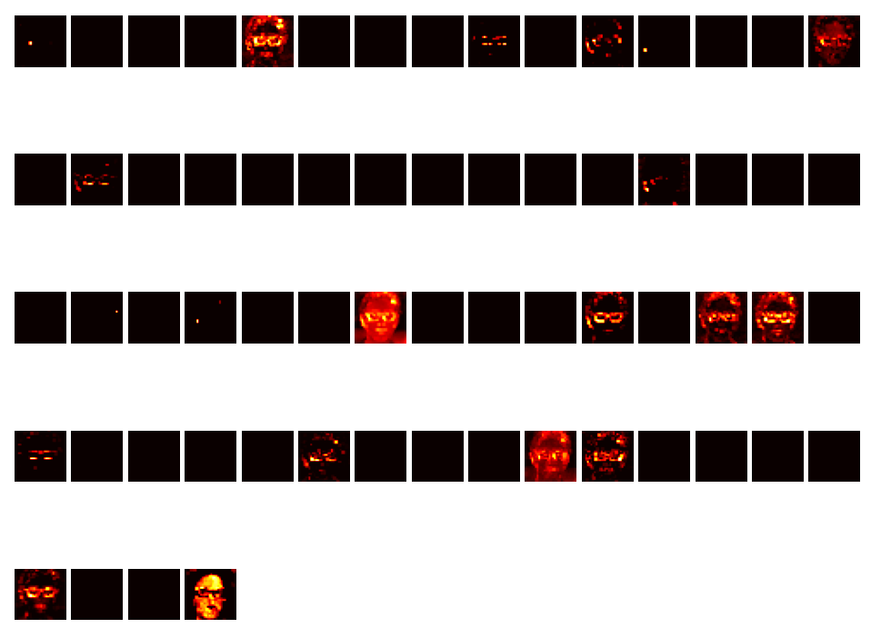

#   [Fake Face Image Classification using Deep Learning](link)

##  1. Introduction
The Face Authentication project aims to develop an effective solution for differentiating between generated images produced by a Generative Adversarial Network (GAN) model and real photographs. The n project utilizes convolutional neural networks (CNNs) implemented in the Keras library to classify images as either real or generated. This technology has potential applications in privacy protection, image manipulation detection, and authenticity verification tools.

##  2. Dataset
The training dataset used in the project consists of 160,000 images. These images are divided into two categories: real photographs and images generated by the GAN model. The real photographs are sourced from the [Flickr-Faces-HQ Dataset](https://github.com/NVlabs/ffhq-dataset), while the generated images are produced using the StyleGAN model. The dataset comprises RGB images with a resolution of 1024x1024 pixels.

##  3. Neural Network Model
The project employs a neural network model inspired by the architecture of AlexNet, a seminal CNN that achieved significant success in the ImageNet Large Scale Visual Recognition Challenge in 2012. Although the model used in this project is not an exact replica of AlexNet, it draws inspiration from its structure and design choices.

###3.1 Model Architecture
The neural network model used in the project consists of 18 layers, including convolutional layers, pooling layers, and fully connected layers. The ReLU activation function, which was a key element introduced by AlexNet, is applied throughout the model. The overall architecture of the model is as follows:

### 3.2 Layer Description
 - Convolutional Layer: This is the first layer of the network, consisting of 16 filters with a size of 2x2. It applies the ReLU activation function to the input image.
 - Convolutional Layer: This layer consists of 32 filters with a size of 10x10 and applies the ReLU activation function.
 - MaxPooling Layer: This layer performs max pooling with a size of 2x2 and stride of 2x2, reducing the feature space.
 - Convolutional Layer: With 64 filters of size 6x6 and the ReLU activation function, this layer extracts further features from the image.
 - MaxPooling Layer: Similar to the previous MaxPooling layer, this layer performs max pooling with a size of 3x3 and stride of 2x2.
 - Convolutional Layer: This layer consists of 128 filters with a size of 3x3 and applies the ReLU activation function.
 - Convolutional Layer: Similar to the previous layer, this layer consists of 128 filters with a size of 3x3 and applies the ReLU activation function.
 - MaxPooling Layer: This layer performs max pooling with a size of 2x2 and stride of 2x2.
 - Fully Connected Layer: This layer is a fully connected layer with 512 neurons and applies the ReLU activation function.
 - Fully Connected Layer: This layer is another fully connected layer with 512 neurons and applies the ReLU activation function.
 - Output Layer: The final layer of the network is a fully connected layer with a single neuron, representing the binary classification output (real or generated).

##  4. Training and Evaluation
The dataset was split into training and validation sets, with a ratio of 80:20. The model was trained using the Adam optimizer and binary cross-entropy loss function. During training, the model's performance was monitored using accuracy and loss metrics. The training process was stopped when no further improvement was observed on the validation set.

After training, the model was evaluated on a separate test set to assess its generalization performance. The accuracy, precision, recall, and F1-score were calculated to evaluate the model's classification performance. The achieved accuracy of 99.5% on the validation set indicates the effectiveness of the model in distinguishing real and fake face images.

##  5. Activation Heatmaps
To gain insights into how the model makes decisions, activation heatmaps were generated. These heatmaps provide visual representations of the areas of the image that contribute most to the model's classification decision. By analyzing these heatmaps, we can better understand the features the model focuses on when classifying an image.

Multiple activation heatmaps were generated for different layers of the model. The heatmaps illustrate the regions with higher activations, indicating the areas of the image that influenced the model's decision the most. The heatmaps consistently highlighted the eyes as the most frequently activated regions. However, other factors such as glasses frames, earrings, teeth, or boundaries between skin and clothing/headwear were also evident in brighter regions.

Examples with heatmaps:

##  6. User Interface
A Flask-based [web page](link) was created to allow image classification as "Real" or "Fake" using the trained Keras model. The application features a simple user interface that enables users to upload an image via a form on the homepage. Upon image submission, the application processes the image to meet the requirements of the classification model.

Before processing the image, the application checks its size and channels. If the image is already 1024x1024 pixels with 3 channels (RGB), it is ready for classification. If the image is too small, an error is displayed. If the image has channels other than RGB, channel conversion takes place. If the image is too large, it is cropped to the desired size of 1024x1024 pixels.

Next, the processed image is saved as a temporary file in the "static" folder. The application utilizes the pre-loaded Keras model to classify the image. The classification result ("Real" or "Fake") is returned to the user.

